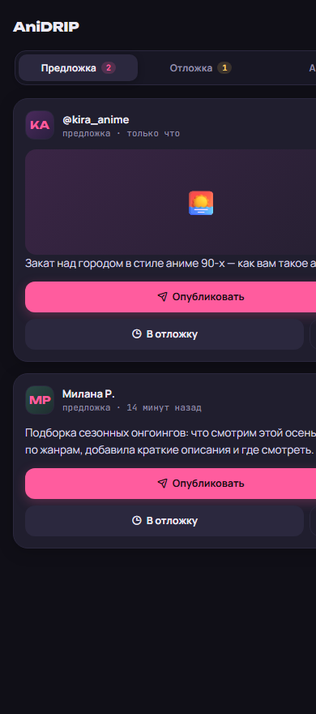
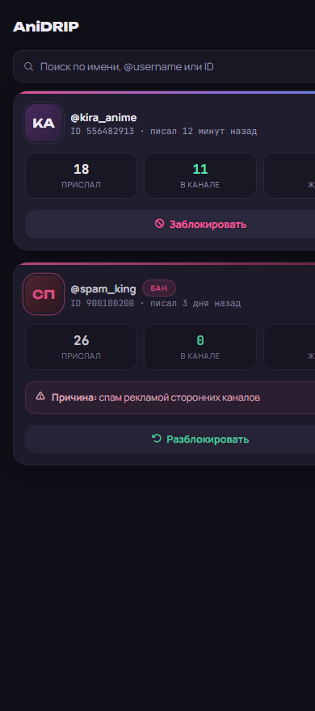

# Предложка — Telegram-бот для приёма и публикации постов

> 📖 **Хотите развернуть этого бота для себя?** Пошаговая инструкция
> «с нуля до работающего бота» — в [**GUIDE.md**](GUIDE.md).

Пользователь присылает боту пост в личку → бот пересылает его в группу
админов с кнопками **📢 Опубликовать** и **🕓 Отложить** → админ выбирает,
публиковать анонимно или с подписью автора → пост уходит в канал сразу
или по расписанию.

Плюс сохранена базовая функция обратной связи: админ отвечает свайпом
(Reply) на сообщение в группе, и ответ уходит автору в личку.

## Как работают кнопки

Под каждой предложкой в группе висят две кнопки. Нажимать их могут только
администраторы группы — права проверяются при каждом нажатии.

1. **📢 Опубликовать** → выбор «🙈 Анонимно» или «✍️ С подписью» →
   пост уходит в канал немедленно.
2. **🕓 Отложить** → выбор подписи → бот просит ввести время ответным
   сообщением → пост встаёт в очередь, кнопка меняется на «🗑 Отменить».

Контент копируется из личного чата с автором, а не из группы, — чтобы
служебная шапка с данными отправителя не попала в канал.

## Форматы времени

| Ввод | Значение |
|---|---|
| `18:30` | сегодня в 18:30 (если время прошло — завтра) |
| `завтра 09:00` | завтра в 09:00 |
| `послезавтра 12:00` | послезавтра в 12:00 |
| `25.08 20:00` | 25 августа текущего года |
| `25.08.2026 20:00` | конкретная дата |
| `+30м` `+2ч` `+1д` | через интервал от текущего момента |
| `+1ч30м` | комбинированный интервал |

Время считается по часовому поясу из переменной `TIMEZONE`.

## Команды (в группе админов)

| Команда | Что делает |
|---|---|
| `/queue` | очередь отложенных постов |
| `/pending` | предложки, ждущие решения |
| `/published` | последние опубликованные |
| `/cancel 12` | отменить отложенную публикацию |
| `/time 12 завтра 09:00` | перенести на другое время |
| `/post 12` | опубликовать сейчас, анонимно |
| `/posts 12` | опубликовать сейчас, с подписью |
| `/mypost` | написать свой пост и поставить в сетку слотов |
| `/bans` | список заблокированных |
| `/unban 123456` | снять блокировку по ID |
| `/id` | узнать ID текущего чата |
| `/panel` | открыть панель модерации (только в личке с ботом) |
| `/help` | справка |

## Блокировка пользователей

Telegram не позволяет боту запретить человеку писать ему, поэтому список
блокировок ведётся в базе: сообщения заблокированных просто не
пересылаются админам, а человеку приходит короткое уведомление, что
отправка для него закрыта.

Два способа заблокировать:

- **Ответом в группе.** Свайпните по сообщению пользователя и напишите
  `бан` — можно с причиной: `бан спам`. Снять блокировку: ответьте
  `разбан`. Понимаются также `ban`, `блок`, `забанить`, `unban`,
  `разблок`, `разбанить`.
- **Из панели.** Кнопка «Люди» в шапке открывает экран со всеми, кто
  писал боту: поиск по имени, @username или ID, статистика по каждому
  и кнопки блокировки. Фильтр «Заблокированные» показывает только их.
  Плюс крестик на карточке предложки даёт выбор: просто отклонить или
  отклонить и забанить.

Командное слово распознаётся только если оно первое в ответе, поэтому
обычные сообщения вроде «Банан это фрукт» уходят пользователю как
текст, а не блокируют его. При блокировке из очереди убираются все
неопубликованные посты этого человека.

## Уведомления автору

Бот пишет автору в личку о судьбе его поста:

- **🕓 «Твой пост #12 отложен — выйдет в канале завтра, 20:00»** — как
  только админ отложил пост (через кнопки в группе, команду `/time`
  или панель). Время указывается в формате, знакомом боту.
- **✅ «Твой пост опубликован в канале!»** со ссылкой на сообщение — в
  момент публикации, автоматической по расписанию или вручную.

При отклонении автору ничего не отправляется. Свои посты админа не
уведомляются, а если человек заблокировал бота — бот молча пишет это в
лог, не ломая саму публикацию.

## Панель модерации (Telegram Mini App)

Команда `/panel` в личке с ботом открывает веб-панель прямо внутри
Telegram: три вкладки — новые предложки, очередь отложенных и история
публикаций, а по кнопке в шапке открывается экран «Люди».

Список подписчиков канала Telegram боту не отдаёт (доступны только
общее число и список админов), поэтому «Люди» — это все, кто когда-либо
писал боту: по каждому видно, сколько прислал, сколько опубликовано и
когда писал в последний раз. Оттуда можно опубликовать, отложить, перенести и отклонить
пост, не переключаясь в группу.

| Предложка | Люди |
|---|---|
|  |  |

В шапке панели есть кнопка обновления — она запускает «жёсткую» перезагрузку:
закрывает все открытые окна и аккордеоны, сбрасывает кэши картинок, поиск и
фильтры, возвращает на вкладку «Предложка» и заново подтягивает данные с сервера.

Кнопки действий в карточках выстроены в едином ритме: в предложке главное
действие («Опубликовать») занимает всю ширину, а «В отложку» и служебные
иконки (отклонить, бан) идут ровным рядом под ним; в отложке «Сейчас» и
«Изменить» — двумя равными кнопками с квадратной иконкой «снять» рядом.

Панель открывается командой `/panel` и в личке, и в группе, но
устроено это по-разному. Обычные кнопки запуска Mini App Telegram
разрешает только в личных чатах, поэтому в группе бот присылает
**прямую ссылку** вида `t.me/имя_бота/panel` — такие ссылки открывают
то же самое приложение и работают в любом чате.

Чтобы ссылка заработала, приложение нужно один раз зарегистрировать:

1. Напишите [@BotFather](https://t.me/BotFather) команду `/newapp` и
   выберите своего бота.
2. Введите название и описание, приложите картинку 640×360
   (анимацию можно пропустить командой `/empty`).
3. Укажите адрес приложения: `https://ваш-сервис.onrender.com/app`
4. Придумайте короткое имя, например `panel`.
5. Впишите это имя в переменную `WEBAPP_SHORT_NAME` на Render.

Пока переменная не задана, панель работает только из лички, а на
команду в группе бот подскажет, что нужно сделать.

Безопасность: каждый запрос из панели проверяется дважды — подпись
Telegram (`initData`, HMAC на основе токена бота) подтверждает, что
запрос действительно пришёл из Mini App и от конкретного человека, а
затем проверяются его права администратора в группе. Одной подписи мало:
она говорит, кто перед нами, но не то, что этому человеку что-то
позволено.

Действия в панели и кнопки в группе синхронизированы: если отложить пост
через панель, кнопки под сообщением в группе тоже обновятся.

## Структура проекта

```
support_bot/
├── bot/
│   ├── config.py         # чтение переменных окружения
│   ├── database.py       # PostgreSQL: посты, статистика авторов, связки
│   ├── keyboards.py      # инлайн-кнопки
│   ├── publisher.py      # публикация в канал + уведомления автору
│   ├── scheduler.py      # фоновая публикация, чистка, недельная сводка
│   ├── timeparse.py      # разбор введённого времени
│   ├── slots.py          # сетка эфира: слоты каждые три часа
│   ├── webauth.py        # проверка подписи Telegram для панели
│   ├── webapp.py         # HTTP-сервер: панель и API к ней
│   ├── static/
│   │   └── index_v2.html # сама панель модерации
│   ├── main.py           # точка входа
│   └── handlers/
│       ├── user.py       # сообщения от пользователей
│       ├── admin.py      # ответы админов через Reply
│       ├── callbacks.py  # нажатия кнопок + ввод времени
│       ├── commands.py   # команды управления очередью
│       └── ownpost.py    # свой пост через чат: текст + кнопки слотов
├── tests/
│   ├── test_publisher.py # публикация и ссылки на канал
│   ├── test_timeparse.py # разбор времени
│   ├── test_slots.py     # сетка слотов и ближайшее свободное окно
│   └── test_webauth.py   # подпись Telegram для панели
├── requirements.txt
└── .env.example
```

## Переменные окружения

| Переменная | Описание |
|---|---|
| `BOT_TOKEN` | токен от @BotFather |
| `ADMIN_GROUP_ID` | ID группы админов (вид `-100…`) |
| `CHANNEL_ID` | ID канала для публикаций (вид `-100…`) |
| `DATABASE_URL` | строка подключения к PostgreSQL |
| `TIMEZONE` | часовой пояс, по умолчанию `Europe/Moscow` |
| `WEBAPP_URL` | адрес сервиса на Render, для панели модерации |
| `WEBAPP_SHORT_NAME` | короткое имя Mini App из BotFather, чтобы открывать панель из группы |
| `PORT` | задаёт Render автоматически, вручную не нужна |

## Подготовка в Telegram

1. Бот должен быть **администратором группы** — иначе Telegram не даст ему
   читать все сообщения, только адресованные напрямую.
2. Бот должен быть **администратором канала** с правом «Публикация
   сообщений».
3. ID группы можно узнать командой `/id`, отправленной в этой группе.
   Для канала так не выйдет: посмотрите внутренний id канала в его
   профиле и припишите спереди `-100` — получится вид `-1001143095101`.

## Про базу данных

Хранение вынесено в PostgreSQL намеренно: на бесплатном тарифе Render
файловая система временная, и SQLite-файл обнулялся бы при каждом
перезапуске — вместе с очередью отложенных постов.

Бесплатный Postgres самого Render не подходит: он истекает через 30 дней
после создания. Подойдёт любой хостинг с бессрочным бесплатным тарифом,
например Neon или Supabase.

### Мусор удаляется, статистика живёт

Раз в сутки планировщик чистит отработанные посты (опубликованные,
отклонённые, снятые, упавшие) старше 30 дней — база не растёт бесконечно
от мусора. Живые предложки и очередь отложенных не трогаются никогда.

Личная статистика каждого автора при этом **не теряется**: она хранится
в отдельной таблице `user_stats` (сколько прислал, сколько в канале, когда
писал последний раз) и живёт вечно, независимо от чистки постов. Именно
из неё панель показывает цифры во вкладке «Люди».

Еженедельно бот присылает в группу админов сводку за последние 7 дней:
сколько предложок пришло, сколько опубликовано и кто стал топ-автором
недели.

## Деплой на Render

- **Type**: Web Service
- **Build Command**: `pip install -r requirements.txt`
- **Start Command**: `python -m bot.main`
- **Environment Variables**: см. таблицу выше

Бот работает через long polling — это постоянный процесс без своего
веб-адреса. Чтобы бесплатный Web Service не засыпал, в проект добавлена
HTTP-заглушка (`start_web_server` в `bot/main.py`), а внешний сервис
вроде [cron-job.org](https://cron-job.org) дёргает адрес бота каждые
10 минут.

## Известные ограничения

- Ввод времени хранится в оперативной памяти: если сервис перезапустится
  ровно между вопросом «когда публикуем» и ответом, нужно нажать кнопку
  заново. Сами отложенные посты при этом не теряются.
- Стикеры и геолокация не поддерживают подпись — при публикации
  «с подписью» автор уходит отдельным сообщением следом.
